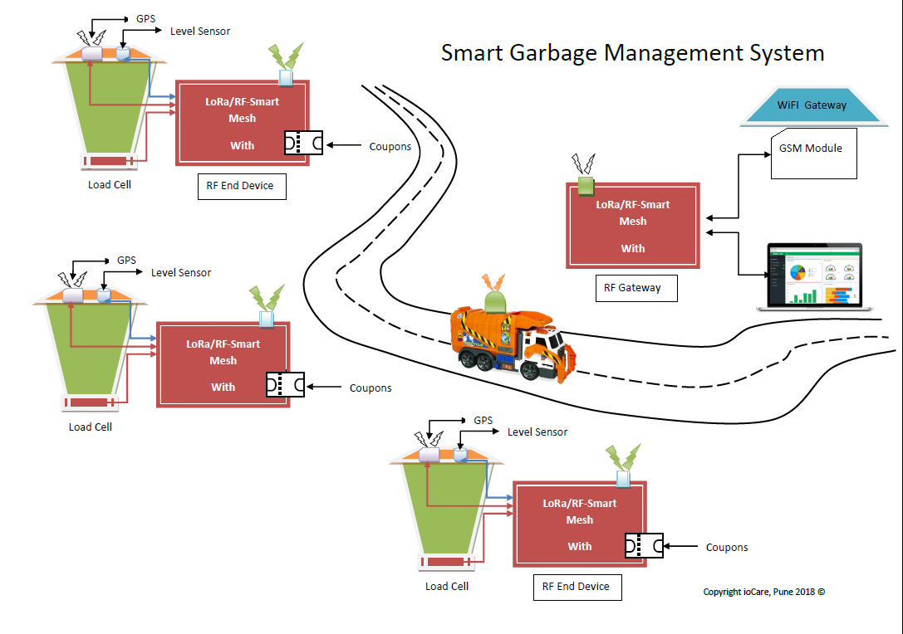
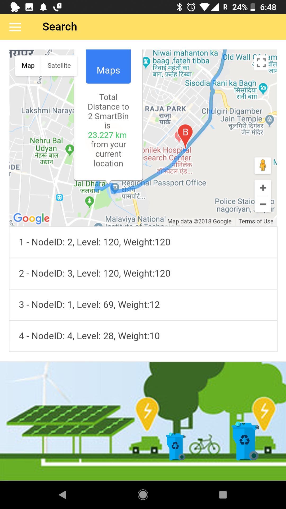

# Smart Garbage Management System

# Problem Statement: 

Garbage Management and Collection in Cities, Town and Villages is a major concern and emerging problem in Smart City paradigm. Also lack of proper resource distribution in the process of Garbage collection is great risk to sanitation, cleanliness and health.
Theme: Internet of Things
Technologies: LoRa, Smart Mesh, RF, WiFi

# Proposed Solution:
We propose a smart Wireless Garbage Bin equipped with LoRa RF and IoT technologies to solve this emerging issue in City/Town sanitation sector. Each Garbage Bin will be equipped with level and weight sensor along with GPS position information in case of any mobility. All data will be sent through LoRa/RF communication "Smart Mesh" link to central server where it can be made available through mobile app to Sanitation workers for quick response and effective collection and disposal of garbage. Efficient route calculation for garbage collector van is also proposed for minimising the efforts in collection.
Benefits of using Smart Garbage Management System
1.	Prevent overflowing of Garbage bins due to real-time status of bins on centralized system and mobile application..
2.	More efficient garbage collection due to availability of empty bins as its collected in time.
3.	Use of LoRa and smart Mesh RF technology prevent any use of infrastructure such as GSM/GPRS or Wi-Fi.
4.	Recurring cost reduction as compare to many existing solutions which uses GSM based approach.
5.	Shortest garbage collection route algorithm calculates best possible route for collection of garbage bins.
6.	Area-wise SMS/Push messages delivered to Municipal Corporation workers to optimise the manpower and energy consumption.
7.	Garbage Reward program to dispense reward/offer coupons to local public based on amount of waste deposited in one time.

